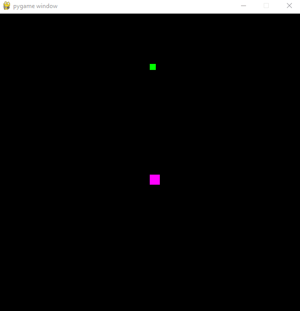

# Pygame-Dodge-Block
The purpose of creating this game was to experiment with **Pygame** (a module for the Python programming language specifically intended to help you make games and other multimedia applications), **regular expressions**, and **frame rates**. As each green block is "consumed" by the purple block, the green block is placed randomly throughout the game board and the level becomes increasingly more difficult. The game ends if the user-controlled purple block exits the game board or collides with the girating red lines which the player must avoid.

## Randomness

